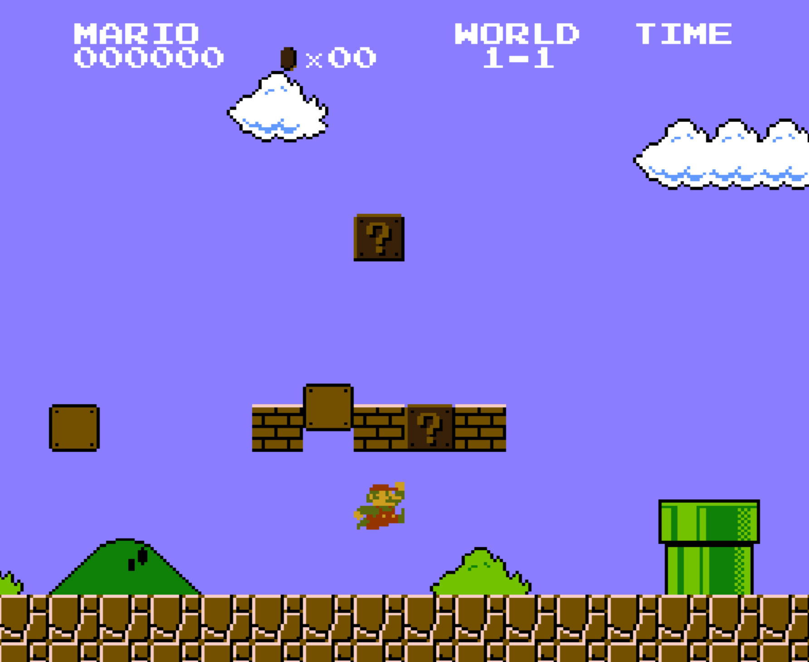

# smolnes-rs

**smolnes-rs** is a Rust port of **smolnes**, a tiny and intentionally minimal NES emulator originally written in C.  
This project focuses on staying as close as possible to the original implementation.



## Controls

| Action     | Key              |
| ---------- | ---------------- |
| DPAD-UP    | <kbd>↑</kbd>     |
| DPAD-DOWN  | <kbd>↓</kbd>     |
| DPAD-LEFT  | <kbd>←</kbd>     |
| DPAD-RIGHT | <kbd>→</kbd>     |
| B          | <kbd>Z</kbd>     |
| A          | <kbd>X</kbd>     |
| START      | <kbd>Enter</kbd> |
| SELECT     | <kbd>Tab</kbd>   |

## Running

```terminal
cargo run path/to/game.nes
```

Use the release build to get a good framerate.

```terminal
cargo run --release path/to/game.nes
```

### Prerequisites

-   **Rust** (stable)
-   **SDL2 development libraries**

### Acknowledgements

binji for the original project
